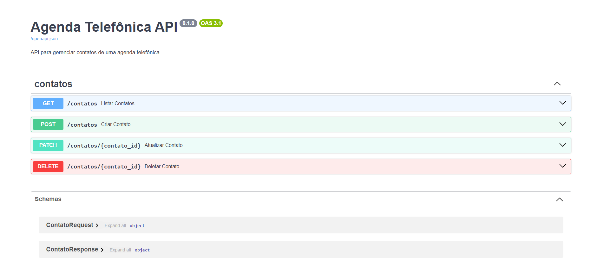

<h1>Agenda Telefônica</h1>

<h2>⚡ Projeto</h2>

A Agenda Telefônica é uma API simples desenvolvida com FastAPI e SQLite, que disponibiliza uma interface para gerenciar contatos. O sistema permite a execução completa das operações CRUD (Criar, Ler, Atualizar e Deletar), armazenando informações essenciais como nome, telefone e e-mail.



Neste projeto, destacam-se as seguintes tecnologias:

- **FastAPI:** framework web de alto desempenho para construção de APIs com Python.

- **Pydantic:** utilizado para garantir que os dados enviados e recebidos estejam corretos e no formato esperado.

- **SQLite:** banco de dados leve e embutido, ideal para aplicações de pequeno e médio porte.

- **SQLModel:** facilita a modelagem de dados e a interação com o banco de dados.

- **Uvicorn:** servidor responsável por executar a aplicação de forma rápida e eficiente.

Ao executar o servidor pela primeira vez, será criado automaticamente o arquivo `agenda_telefonica.db`, contendo o banco de dados e as tabelas necessárias para o funcionamento da aplicação.

## 🛠️ Manual do Desenvolvedor

1. Clone o repositório:
   ```bash
   git clone https://github.com/afcj8/agenda_telefonica.git
   ```

2. Verifique se o Python está instalado em sua máquina:
   ```bash
   python --version
   ```

3. Navegue até o diretório clonado:
   ```bash
   cd agenda_telefonica
   ```

4. Crie um ambiente virtual:
   ```bash
   python -m venv venv
   ```

5. Ative o ambiente virtual:
   - Windows:
     ```bash
     venv\Scripts\activate
     ```
   - Linux/Mac:
     ```bash
     source venv/bin/activate
     ```

6. Instale as dependências:
   ```bash
   pip install -r requirements.txt
   ```

7. Execute a aplicação com o Uvicorn:
   ```bash
   uvicorn api.app:app --reload
   ```

8. Acesse a documentação (Swagger UI) no navegador com a seguinte URL:
   ```bash
   http://localhost:8000/docs
   ```